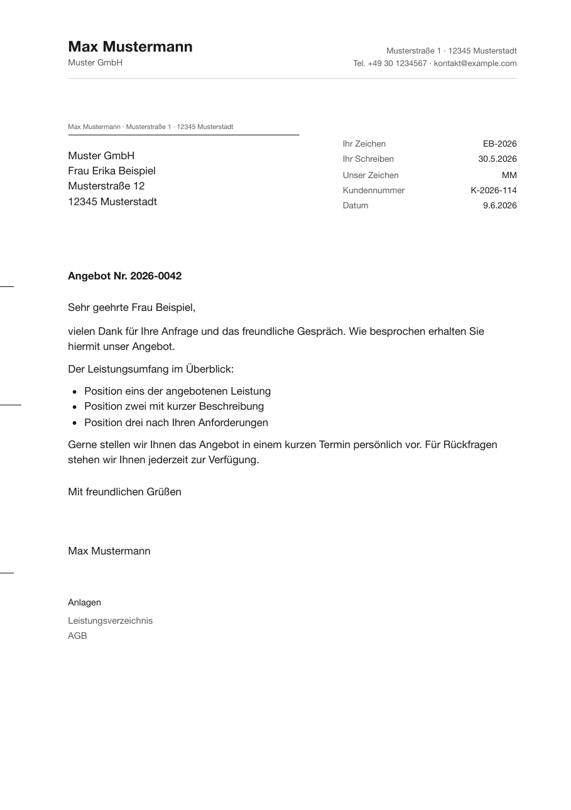

# Briefkopf – Letter Generator

> 🇩🇪 Deutsch · [🇬🇧 English](README.md)

Ein Obsidian-Plugin, das aus einer Notiz einen professionell formatierten Geschäftsbrief macht — deutscher **DIN 5008** oder ein klares **modernes** Layout — und ihn über den Druckdialog als PDF exportiert, auf Desktop **und iPhone/iPad**.

[](LICENSE)
[](LICENSE-DOCS)
-lightgrey)



## Funktionen

- **Zwei Layouts:** `DIN 5008` (deutscher Standard, fensterkuvert-tauglich) und `Modern` (international).
- **Drei Stile per Dropdown:** Sachlich-modern, Klassisch-seriös, Technisch-präzise — plus Infozeile „Vollständig" (Infoblock) oder „Nur Datum"; beides pro Brief im Frontmatter überschreibbar.
- **Metadaten aus dem Frontmatter:** Empfänger und Absender als YAML-Listen, Betreff, Anrede, Grußformel, Datum, Infoblock (inkl. Steuernummer + freie Zeilen), Anlagenvermerk — deutsche und englische Feld-Aliasse. Befehl **„Brief-Frontmatter in Notiz einfügen"** legt die Felder an; die Einstellungen zeigen eine Feldübersicht.
- **Absender-Profil** in den Einstellungen, pro Brief überschreibbar (Liste `absender` oder Einzelfelder).
- **PDF-Export per Druckdialog** → „Als PDF sichern". Plattformübergreifend (Desktop + iOS), weil das OS das CSS rendert — kein Electron, kein Node. Druckränder werden automatisch gesetzt (Seite 1 oben 10 mm, Folgeseiten 25 mm, unten 20 mm) — DIN-Positionen bleiben papiergenau.
- **Seitenechte Vorschau:** zeigt die fertigen A4-Blätter inklusive Seitenumbrüchen.
- **DIN-Extras:** Faltmarken (105/210 mm bzw. 87/192 mm), Lochmarke (148,5 mm), Druckversatz-Feinjustierung fürs Kuvertfenster.
- **Kein CSS nötig** — Stil und Infozeile direkt in den Einstellungen; für Feinschliff bleiben dokumentierte CSS-Design-Tokens + kommentiertes Preset auf Knopfdruck.
- Abhängigkeitsfrei, mobil-tauglich (`isDesktopOnly: false`), AGPL-3.0.

## Schnellstart

```bash
# Manuelle Installation: Plugin in den Vault kopieren
cp manifest.json main.js styles.css versions.json \
   "<dein-vault>/.obsidian/plugins/briefkopf/"

# …oder mit gesetztem OBSIDIAN_PLUGIN_DIR:
npm run deploy
```

Dann: Obsidian → Einstellungen → Community-Plugins → neu laden → **Briefkopf** aktivieren → Absender-Profil ausfüllen.

## Nutzung

1. Notiz öffnen und mit dem Befehl **„Brief-Frontmatter in Notiz einfügen"** die Felder anlegen (oder siehe [Beispiel](examples/Beispielbrief.md)), dann ausfüllen.
2. Befehl **„Brief als PDF exportieren / drucken"** (Befehlspalette oder Briefumschlag-Icon). Mit **„Brief-Vorschau öffnen"** vorab seitenecht prüfen.
3. Im Druckdialog **„Als PDF sichern"** wählen (macOS: PDF-Dropdown; iOS: Teilen → „In Dateien sichern"), Skalierung auf 100 % lassen.

Der Notiztext unter dem Frontmatter ist der Brieftext und wird als Markdown gerendert.

## Dokumentation

- [Tutorial — dein erster Brief](docs/tutorial.md)
- [Referenz — Frontmatter-Felder](docs/reference/frontmatter.md) · [Einstellungen](docs/reference/settings.md) · [Theming / CSS-Tokens](docs/reference/theming.md)
- [Erläuterung — DIN-5008-Maße](docs/explanation/din5008.md)

## Theming

Stil und Infozeile wählst du direkt in den Einstellungen — ganz ohne CSS. Für Feinschliff darüber hinaus läuft das Aussehen komplett über CSS Custom Properties (Design-Tokens): In **Einstellungen → Erweitert → „Preset einfügen"** gibt es einen kommentierten Startpunkt, alternativ [`presets/briefkopf-theme.css`](presets/briefkopf-theme.css). Als *DIN-kritisch* markierte Geometrie-Tokens halten die Anschrift im Kuvertfenster — bewusst ändern. Vollständige Tokenliste: [docs/reference/theming.md](docs/reference/theming.md).

## Lizenz

Code: **AGPL-3.0-or-later** — siehe [`LICENSE`](LICENSE); kommerzielle Dual-License-Option in [`LICENSING.md`](LICENSING.md).
Dokumentation/Texte: **CC BY-SA 4.0** — siehe [`LICENSE-DOCS`](LICENSE-DOCS).
