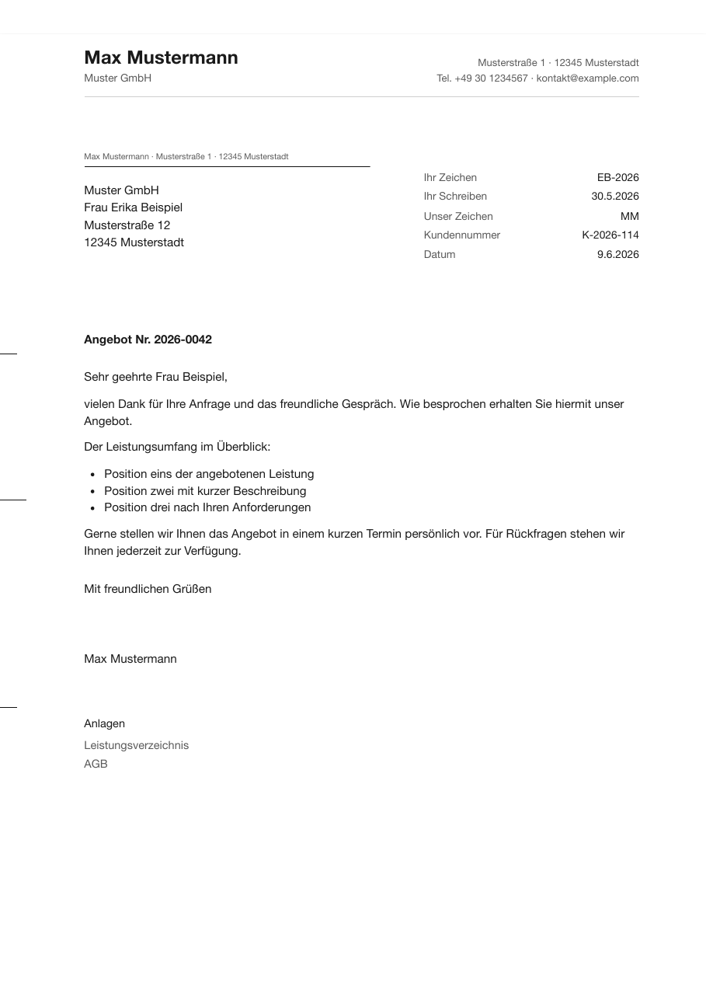
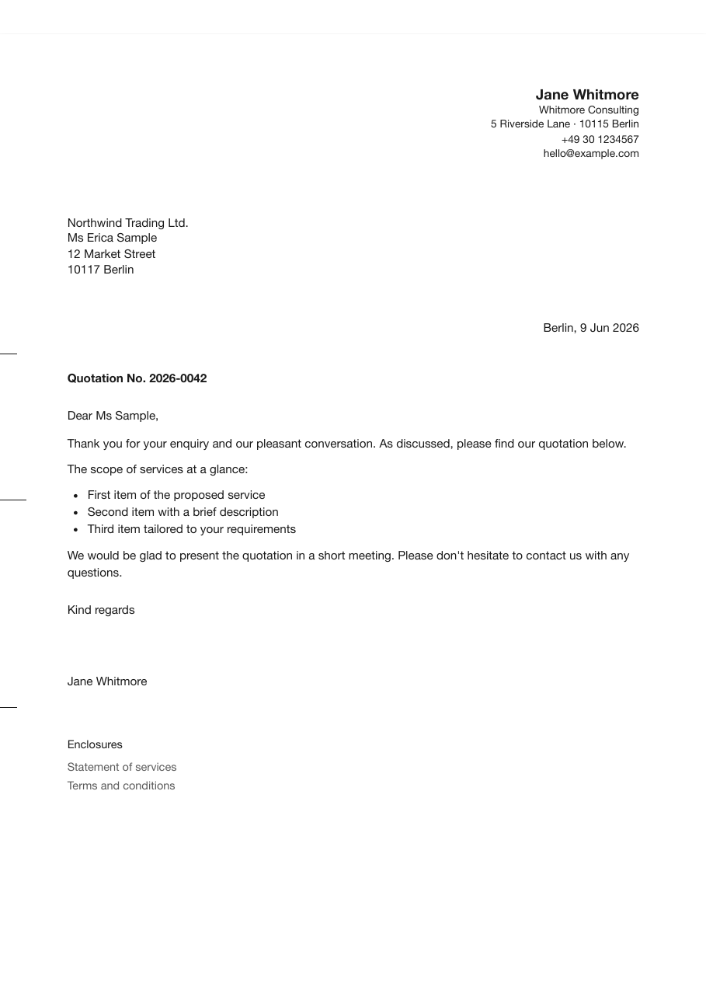

# Letterhead – DIN 5008 & modern letters

> 🇩🇪 Deutsch · [🇬🇧 English](README.md)

Ein Obsidian-Plugin, das aus einer Notiz einen professionell formatierten Geschäftsbrief macht — deutscher **DIN 5008** oder ein klares **modernes** Layout — und ihn als PDF exportiert: auf dem Desktop per Druckdialog, auf **iPhone/iPad** über Schnellansicht → Drucken → In Dateien sichern.

[](LICENSE)
[](LICENSE-DOCS)
-lightgrey)

<p>
  
  
</p>

<sub><b>DIN 5008</b> (Deutsch) · <b>Modern</b> (Englisch) — zwei Layouts, zwei Briefsprachen.</sub>

## Funktionen

- **Briefe aus deinen Notizen:** Das Frontmatter einer Notiz hält die Metadaten, der Notiztext (Markdown) wird zum Brieftext — ein Befehl macht daraus einen fertig formatierten Geschäftsbrief.
- **PDF-Export & Druck, überall:** Desktop (macOS/Windows/Linux) → Druckdialog → „Als PDF sichern"; **iPhone/iPad** → geführte Schritte über das System-Teilen-Menü (Öffnen → Schnellansicht → Teilen → Drucken → Vorschau aufziehen → „In Dateien sichern"). Das OS rendert das CSS — kein Electron, kein Node. Druckränder werden automatisch gesetzt (Seite 1 oben 10 mm, Folgeseiten 25 mm, unten 20 mm) — DIN-Positionen bleiben papiergenau.
- **Zwei Layouts:** `DIN 5008` (deutscher Standard, fensterkuvert-tauglich) und `Modern` (international) — wählbar unter **Einstellungen → Layout**.
- **Drei Stile per Dropdown:** Sachlich-modern, Klassisch-seriös, Technisch-präzise — plus Infozeile „Vollständig" (Infoblock) oder „Nur Datum"; beides pro Brief im Frontmatter überschreibbar.
- **Zweisprachig:** Plugin-UI folgt der Obsidian-App-Sprache (Englisch/Deutsch); die Briefsprache ist separat einstellbar — deutsche oder englische Brief-Labels (Anlagen/Enclosures, Ihr Zeichen/Your ref., …), pro Brief per Frontmatter `sprache` umschaltbar.
- **Metadaten aus dem Frontmatter:** Empfänger und Absender als YAML-Listen, Betreff, Anrede, Grußformel, Datum, Infoblock (inkl. Steuernummer + freie Zeilen), Anlagenvermerk — deutsche und englische Feld-Aliasse. Befehl **Insert letter frontmatter into note** legt die Felder an; die Einstellungen zeigen eine Feldübersicht.
- **Absender-Profil** in den Einstellungen, pro Brief überschreibbar (Liste `absender` oder Einzelfelder).
- **Seitenechte Vorschau:** zeigt die fertigen A4-Blätter inklusive Seitenumbrüchen.
- **DIN-Extras:** Faltmarken (105/210 mm bzw. 87/192 mm), Lochmarke (148,5 mm), Druckversatz-Feinjustierung fürs Kuvertfenster.
- **Kein CSS nötig** — Stil und Infozeile direkt in den Einstellungen; für Feinschliff bleiben dokumentierte CSS-Design-Tokens + kommentiertes Preset auf Knopfdruck.
- **Komplett offline** — keine Netzwerkaufrufe, keine Telemetrie; das Rendering läuft lokal über die Druck-Engine des Betriebssystems.
- Abhängigkeitsfrei, mobil-tauglich (`isDesktopOnly: false`), AGPL-3.0.

## Schnellstart

Repository: [github.com/johannes-kaindl/obsidian-letterhead](https://github.com/johannes-kaindl/obsidian-letterhead)
(Quell-Mirror: [codeberg.org/jkaindl/obsidian-letterhead](https://codeberg.org/jkaindl/obsidian-letterhead))

### Via BRAT (Beta)

1. Das Community-Plugin [**BRAT**](https://github.com/TfTHacker/obsidian42-brat) installieren.
2. **BRAT → Add beta plugin** öffnen und `johannes-kaindl/obsidian-letterhead` eingeben.
3. **Letterhead** unter Einstellungen → Community-Plugins aktivieren.

### Manuelle Installation

```bash
# Plugin in den Vault kopieren
cp manifest.json main.js styles.css versions.json \
   "<dein-vault>/.obsidian/plugins/letterhead/"

# …oder mit gesetztem OBSIDIAN_PLUGIN_DIR:
npm run deploy
```

Dann: Obsidian → Einstellungen → Community-Plugins → neu laden → **Letterhead** aktivieren → Absender-Profil ausfüllen.

## Nutzung

1. Notiz öffnen und mit dem Befehl **Insert letter frontmatter into note** die Felder anlegen (oder siehe [Beispiel](examples/example-letter.md)), dann ausfüllen.
2. Befehl **Export letter as PDF / print** (Befehlspalette oder Briefumschlag-Icon). Mit **Open letter preview** vorab seitenecht prüfen.
3. **Desktop:** Im Druckdialog **„Als PDF sichern"** wählen (macOS: PDF-Dropdown unten links), Skalierung auf 100 % lassen. **iPhone/iPad:** iOS zeigt einen Dialog — **Öffnen** → **Schnellansicht** → Teilen → **Drucken** → Vorschau mit zwei Fingern aufziehen (wird zum PDF) → Teilen → **„In Dateien sichern"**.

Der Notiztext unter dem Frontmatter ist der Brieftext und wird als Markdown gerendert.

## Dokumentation

- [Tutorial — dein erster Brief](docs/tutorial.de.md)
- [Referenz — Frontmatter-Felder](docs/reference/frontmatter.de.md) · [Einstellungen](docs/reference/settings.de.md) · [Theming / CSS-Tokens](docs/reference/theming.de.md)
- [Erläuterung — DIN-5008-Maße](docs/explanation/din5008.de.md)

## Theming

Stil und Infozeile wählst du direkt in den Einstellungen — ganz ohne CSS. Für Feinschliff darüber hinaus läuft das Aussehen komplett über CSS Custom Properties (Design-Tokens): Das Feld **Custom CSS** (**Einstellungen → Advanced**) ist mit einem vollständig auskommentierten Preset vorbefüllt — eine Zeile einkommentieren und anpassen; der Button **Reset preset** stellt diesen Ausgangszustand wieder her, alternativ [`presets/letterhead-theme.css`](presets/letterhead-theme.css) kopieren. Als *DIN-kritisch* markierte Geometrie-Tokens halten die Anschrift im Kuvertfenster — bewusst ändern. Vollständige Tokenliste: [docs/reference/theming.de.md](docs/reference/theming.de.md).

## Lizenz

Code: **AGPL-3.0-or-later** — siehe [`LICENSE`](LICENSE); kommerzielle Dual-License-Option in [`LICENSING.md`](LICENSING.md).
Dokumentation/Texte: **CC BY-SA 4.0** — siehe [`LICENSE-DOCS`](LICENSE-DOCS).
